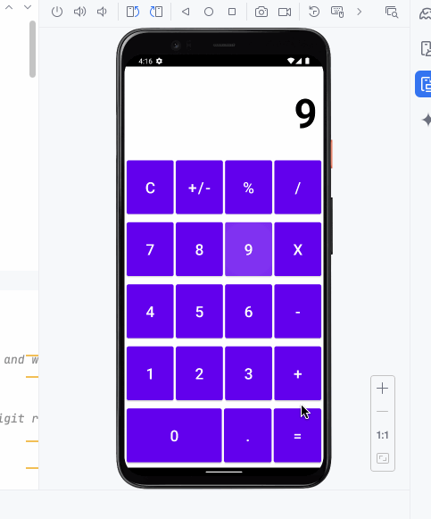

# Android CalculatorApp

This is a simple **calculator app** built for Android using **Kotlin and XML**.  
It mimics the behavior of the default iOS calculator, allowing users to perform basic arithmetic operations.

## Functionality 

The following **required** functionality is completed:

* User sees a calculator layout with buttons for digits, operations, and special functions.
* User can perform addition, subtraction, multiplication, and division.
* User can clear the display using the `C` button.
* User can change the sign of a number using the `+/-` button.
* User can calculate percentages using the `%` button.
* User sees live updates of their input in the top `TextView`.
* User can enter decimal numbers using the `.` button.
* User can chain multiple operations without pressing `=` after every step.

The following extensions are implemented:

* Handles division by zero by showing `Error` or `Infinity`.
* Prevents multiple leading zeros (e.g., entering `0005` displays as `5`).
* Supports real-time updates of calculations while entering numbers.

## Video Walkthrough

Here's a walkthrough of implemented user stories:

## Notes

### Challenges Faced
1. UI Layout Issues:**
   - `GridLayout` was initially not expanding correctly, causing buttons to be hidden.  
   - Fixed by ensuring correct constraints and layout percentages.  

2. Handling Edge Cases: 
   - Division by zero needed proper handling to prevent app crashes.  
   - Input validation was necessary to prevent multiple decimal points.  

## License

    Copyright 2024 [Abirami Saravanan, Harish Suresh]

    Licensed under the Apache License, Version 2.0 (the "License");
    you may not use this file except in compliance with the License.
    You may obtain a copy of the License at

        http://www.apache.org/licenses/LICENSE-2.0

    Unless required by applicable law or agreed to in writing, software
    distributed under the License is distributed on an "AS IS" BASIS,
    WITHOUT WARRANTIES OR CONDITIONS OF ANY KIND, either express or implied.
    See the License for the specific language governing permissions and
    limitations under the License.
