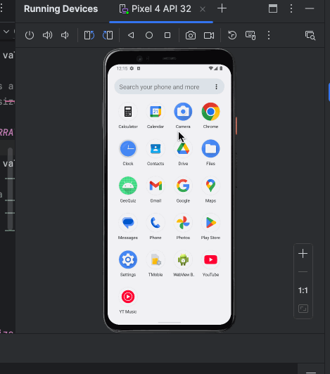

# Android Calculator App

A robust calculator application for Android that provides basic arithmetic operations with persistence across orientation changes. The app features both portrait and landscape modes with additional scientific functions in landscape orientation.

## Functionality 

The following **required** functionality is completed:

* [x] Basic arithmetic operations (addition, subtraction, multiplication, division)
* [x] Clear button (C) to reset calculations
* [x] Positive/negative number toggle (+/-)
* [x] Percentage calculation (%)
* [x] Persistent calculation state across orientation changes
* [x] Button click logging using LogCat
* [x] Custom calculator app icon
* [x] Landscape mode with additional scientific functions

The following **extensions** are implemented:

* Enhanced UI with consistent 2dp margins between components
* Bold text display with 80sp size for results
* Double-width zero button for improved usability
* Null safety checks for landscape-specific buttons
* iPhone-style calculation flow:
  - Displays previous number until new number entry begins
  - Immediate calculation on consecutive operation presses

## Video Walkthrough

Here's a walkthrough of implemented user stories:

## Notes

Challenges encountered while building the app:

* Implementing state persistence across orientation changes required careful handling of lifecycle methods
* Managing different layouts for portrait and landscape modes while maintaining consistent functionality
* Ensuring proper null checking for landscape-specific buttons to prevent crashes
* Implementing iPhone-style calculation flow required careful state management

## License

    Copyright 2025 Harish Suresh

    Licensed under the Apache License, Version 2.0 (the "License");
    you may not use this file except in compliance with the License.
    You may obtain a copy of the License at

        http://www.apache.org/licenses/LICENSE-2.0

    Unless required by applicable law or agreed to in writing, software
    distributed under the License is distributed on an "AS IS" BASIS,
    WITHOUT WARRANTIES OR CONDITIONS OF ANY KIND, either express or implied.
    See the License for the specific language governing permissions and
    limitations under the License.